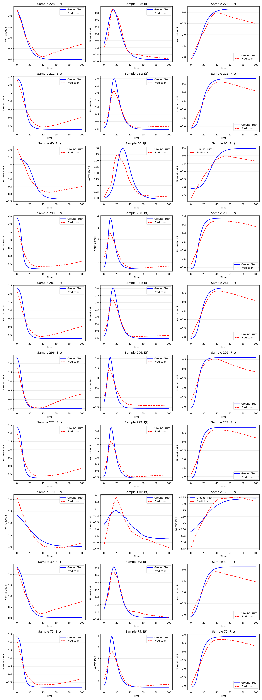

# Learning the Susceptible-Infected-Removed Model - GSoC 2026 Submission

A complete machine learning pipeline to deduce the deterministic **Susceptible-Infected-Removed (SIR)** epidemic model equations from stochastic simulations.

## Project Overview

This 5-stage project learns differential equations $\frac{dS}{dt}, \frac{dI}{dt}, \frac{dR}{dt}$ from stochastic epidemics:

$$\frac{dS}{dt} = -\frac{\beta SI}{N}, \quad \frac{dI}{dt} = \frac{\beta SI}{N} - \gamma I, \quad \frac{dR}{dt} = \gamma I$$

## Motivation

Standard epidemiological models like SIR assume constant transmission (β) and recovery (γ) rates. However, rapidly mutating pathogens, behavioral changes, and policy interventions often violate these assumptions. Automated symbolic equation discovery enables **real-time adaptation** of ODE models,rather than manually tuning parameters, this pipeline trains neural networks on recent epidemic data and automatically extracts new mathematical forms that capture current dynamics. This project demonstrates how machine learning can accelerate model discovery in infectious disease research, bridging stochastic simulations (ground truth) and interpretable symbolic equations (deployment).

## Organization Alignment: HumanAI Foundation

This project is submitted as a proposal for the **HumanAI Foundation** under GSoC 2026. It directly supports the foundation's mandate to develop openly available tools for rapid epidemic modeling. By automating symbolic equation discovery from stochastic simulations, this pipeline bridges the gap between complex data and interpretable ODE models, essential for epidemiologists to rapidly adapt models to emerging pathogens.

**Quick Stats** 

| Compartment | Test R² | MSE | MAE | 
|-------------|---------|-----|-----|
| S (Susceptible) | 0.8471 | 0.1529 | 0.3331 |
| I (Infected) | 0.8848 | 0.1152 | 0.2136 | 
| R (Recovered) | 0.8654 | 0.1346 | 0.3126 |
| **Average** | **0.8658** | — | — | 

## 5-Stage Pipeline

| Stage | Task | Output |
|-------|------|--------|
| **1** | Stochastic SIR simulation (Gillespie algorithm) | Mean trajectories for 2,000 parameter points |
| **2** | Data pipeline & normalization | PyTorch DataLoader with 70/15/15 train/val/test split |
| **3** | MLP training (balanced regularization) | Trained MLP |
| **4** | Symbolic recovery (PySR) | Discovered ODE equations in symbolic form |
| **5** | Evaluation & validation | Per-compartment metrics, visualizations, error analysis |

## Installation

```bash
# Create environment
python -m venv venv
source venv/bin/activate

# Install dependencies
pip install -r requirements.txt

# Verify installation
python -c "import torch; import pysr; print('Dependencies installed')"
```
## Quick Start

Run the complete pipeline from the project root:

```bash
python scripts/main.py
```
The pipeline will automatically execute all 5 stages in sequence (see table above). Output will be generated in:
- `src/data/` :   Simulations and datasets
- `src/checkpoints/` :   Trained MLP model
- `src/results/` :   Evaluation metrics and visualizations

## Key Libraries Used

| Library | Purpose |
|---------|---------|
| **PyTorch** | Deep learning framework for MLP model training and inference |
| **NumPy** | Numerical computations and array operations for simulations |
| **Pandas** | Data manipulation and analysis for datasets |
| **Matplotlib** | Visualization of trajectories and results |
| **SciPy** | Scientific computing utilities (optimization, statistics) |
| **scikit-learn** | ML utilities (train/test split, metrics, preprocessing) |
| **PySR** | Symbolic regression via genetic algorithm (Stage 4) |
| **SymPy** | Symbolic mathematics for equation manipulation |
| **tqdm** | Progress bar utilities for long-running processes |

## File Structure

```
SIR/
├── scripts/
│   └── main.py                  # Main orchestration script (entry point)
├── requirements.txt             # Python dependencies
├── README.md                    # This file
│
├── src/sir/
│   ├── config.py                # Configuration (stages, paths, seeds)
│   ├── config_balanced.py       # MLP balanced regularization config
│   ├── __init__.py
│   │
│   ├── models/
│   │   ├── mlp_model.py         # Stage 3: MLP training
│   │   └── __init__.py
│   │
│   ├── pipeline/
│   │   ├── stochastic_sim.py    # Stage 1: Gillespie algorithm
│   │   ├── data_pipeline.py     # Stage 2: PyTorch data prep
│   │   ├── symbolic_recovery.py # Stage 4: PySR symbolic regression
│   │   ├── evaluation.py        # Stage 5: Metrics & visualization
│   │   └── __init__.py
│   │
│   ├── utils/
│   │   ├── utils.py             # Utility functions (normalization, seeds, etc)
│   │   └── __init__.py
│   │
│   ├── data/                    # Generated simulations & datasets
│   ├── checkpoints/             # Trained MLP model weights
│   └── results/                 # Stage 5 evaluation metrics & plots 
│   
└── tests/
    └── test_ood_balanced.py     # Out-of-distribution generalization test
```


## Stage Details

### Stage 1: Stochastic Simulation
- Uses **Gillespie algorithm** for exact stochastic SIR dynamics
- Samples parameter grid: β ∈ [0.3, 0.8], γ ∈ [0.1, 0.3], N ∈ [1k, 5k], I₀ ∈ [10, 50]
- Runs 50 stochastic trajectories per parameter point → computes mean
- Output: 2,000 × 101 × 3 tensor of mean (S, I, R) trajectories

### Stage 2: Data Pipeline
- **Normalize** compartments to [0, 1]
- **Split** into 70% train / 15% val / 15% test (no parameter leakage)
- Create PyTorch `Dataset` & `DataLoader` for efficient batch training
- Parameters normalized to [-1, 1] for network stability

### Stage 3: MLP Training (Balanced Regularization)
- **Architecture**: MLP with hidden dims [96, 96], dropout 0.2 regularization
- **Input**: (β, γ, N, I₀, t) :   5D vector per time point
- **Output**: (S, I, R) :   3D compartment predictions
- **Training**: Adam optimizer with weight_decay 0.01, early stopping (patience=8)

### Stage 4: Symbolic Recovery (Loss-Based Ranking)

**Approach**: Discovers symbolic ODE equations from trained MLP using PySR genetic algorithm
- **Features**: 9 engineered features (S, I, R, β, γ, S.I, S.I/N, β.S.I, γ.I) enable SIR discoveries
- **Ranking**: Equations ranked by **test loss** (accuracy), not complexity , ensures meaningful variables
- **Output**: Top 10 equations per compartment, loss-ranked for predictive quality

**See**: [RESULTS_SUMMARY.md](src/results/RESULTS_SUMMARY.md#symbolic-recovery-stage-4) for methodology details, discovered equations, and why loss-based ranking works.

### Stage 5: Evaluation
- **R² Score**: Goodness of fit on held-out test data
- **MSE/MAE**: Trajectory prediction error
- **Visualizations**: Sample predictions vs. ground truth
- **Model validation**: Predict (S, I, R) on held-out test data and compute accuracy metrics

## Key Concepts

### Gillespie Algorithm (Stage 1)
Exact stochastic simulation of SIR epidemics:
- **Reaction rates**: Infection β·S·I/N, Recovery γ·I
- **Jump chain**: Exponential waiting times proportional to compartment sizes
- **Output**: Stochastic trajectories averaged over 50 replicates per parameter point

### MLP Point-wise Prediction (Stage 3)
- **Input**: (β, γ, N, I₀, t) : parameters + time point
- **Output**: (S, I, R) : compartment values
- **Result**: 86.58% average R², avoiding ODE solver complexity for fast inference

## Results

**Full Results Summary**: [src/results/RESULTS_SUMMARY.md](src/results/RESULTS_SUMMARY.md)
- Detailed methodology for all 5 stages
- Discovered symbolic equations with complexity/loss metrics
- Full performance analysis and interpretation

### Visualizing Predictions
The model successfully captures the non-linear dynamics of the epidemics across varying parameter regimes. Below, predictions (red dashed lines) are plotted against the Gillespie stochastic ground truth (solid blue lines) for the Susceptible, Infected, and Recovered compartments.



**Author**
- **Name**: Devi Sri Bandaru
- **Email**: [bandarudevisri.ds@gmail.com](bandarudevisri.ds@gmail.com)
- **LinkedIn**: [https://linkedin.com/in/devisri-bandaru](https://linkedin.com/in/devisri-bandaru)
- **GitHub**: [https://github.com/Devisri-B](https://github.com/Devisri-B)
- **For GSoC 2026**
